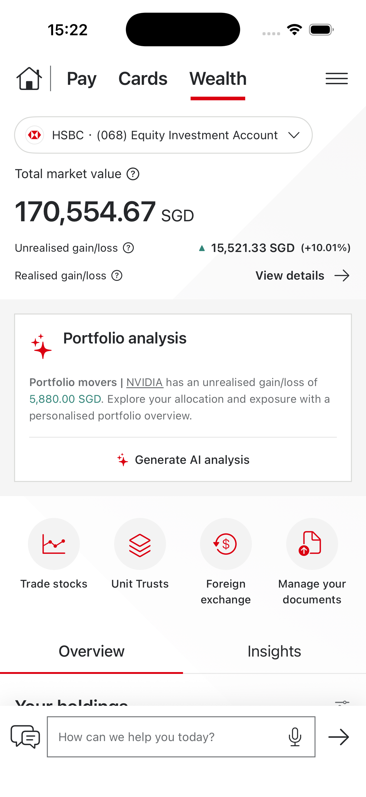
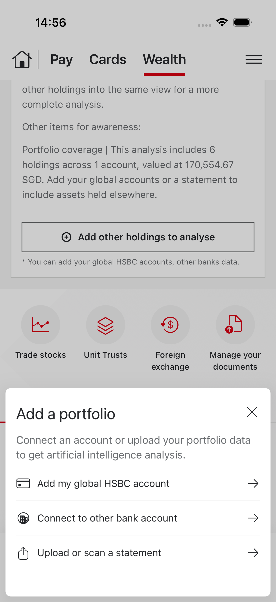
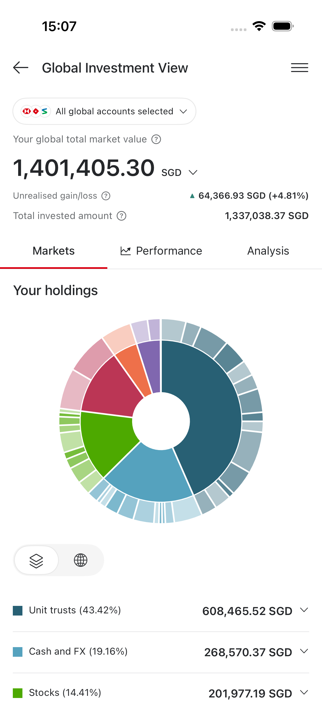
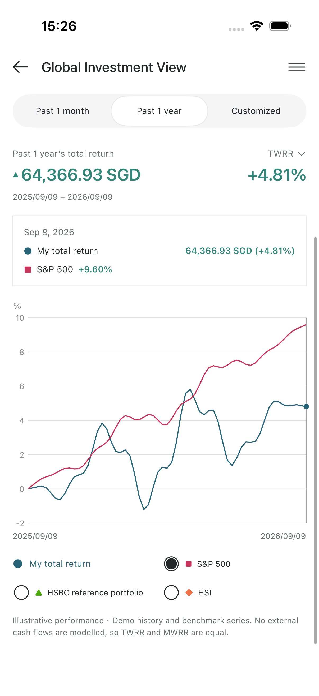

# HSBC SG iOS Demo

[English](README.md) | [简体中文](README.zh-CN.md)

原生 SwiftUI + Swift Charts 资产分析、多账户管理与账户对比 Demo。最低 iOS 17，无第三方运行时依赖。

## 下载 iPhone 安装包

**[下载 HSBC-SG.ipa](https://github.com/targetkiller/HSBCSGWealthDemo/releases/latest/download/HSBC-SG.ipa)** · **[所有发布版本](https://github.com/targetkiller/HSBCSGWealthDemo/releases)**

下载文件为未签名的真机 IPA，支持 iOS 17 及以上版本，需自行签名后安装到 iPhone。

通过 Apple TestFlight 分发请参阅 **[中文提交指南](docs/TESTFLIGHT.zh-CN.md)** 或 **[English submission guide](docs/TESTFLIGHT.md)**，包含账号配置、归档上传及邀请测试员的步骤。

App Store Connect 截图和审核素材请参阅[原生截图生成说明](docs/APP_STORE_SCREENSHOTS.md)及[元数据草稿](docs/APP_STORE_METADATA.md)。截图脚本从 iPhone、iPad 模拟器导出真实界面，使用 Apple 接受的上传尺寸。

安装后的 App 名称为 **HSBC SG**，图标使用用户提供的 HSBC SG 图片。工程与 scheme 仍为 `WealthHub`。

设计依据：[Figma Wealth Hub](https://www.figma.com/design/asmxuHgmIG5e4NMJHstoZh/Untitled?node-id=0-1)。主界面使用原稿的 Home／Pay／Cards／Wealth 顶部导航，默认进入 Wealth，移除原有自定义底部 Tab Bar。重点展示 Wealth 分析卡片、添加其他持仓、账户选择、配置分析、风险／压力测试、产品服务与底部助手栏。Pay／Cards／Home 和产品业务仅保留简洁预览。

## 运行

打开 `WealthHub.xcodeproj`，选择 **WealthHub** scheme 与 iPhone 模拟器，点击 Run。模拟器不需要开发者签名；真机运行需在 Signing & Capabilities 选择自己的开发团队。

已在 iPhone 模拟器构建并运行。也可使用随附脚本一键构建、安装和启动：

```bash
git clone https://github.com/targetkiller/HSBCSGWealthDemo.git
cd HSBCSGWealthDemo
bash scripts/run-demo.sh
```

脚本选择已启动的 iPhone 模拟器（否则使用第一个可用 iPhone）；也可传入模拟器 UDID。需要已安装 Xcode、iOS 模拟器运行时及 Python 3。若有 XcodeGen，自动重新生成工程；否则使用已提交的 `.xcodeproj`。

## 界面预览

| Wealth | 添加持仓 | Global Investment View | Performance |
| --- | --- | --- | --- |
|  |  |  |  |

## 可演示流程

1. **Wealth**：默认新加坡 HSBC 股票投资账户；选择单／多账户、切换报告币种、总市值、收益及 View details。金额统一使用 `1,234.00 SGD` 等币种后缀格式。
2. **Portfolio analysis**：Generate AI analysis → 加载 → 展开的 What happened／What’s next；支持收起、重新生成。内容随所选持仓计算，不编造实时市场新闻。
3. **Add other holdings to analyse**：打开原稿 Add a portfolio 底部弹层，可添加全球 HSBC 账户、连接其他银行或上传／扫描账单。全球 HSBC 路径选择现有账户而不重复创建；银行路径使用本地样本及确认步骤。
4. **Upload or scan a statement**：Upload／Take a photo／Cancel；支持 CSV、PDF 和图片本地提取。模拟器无摄像头时可选择图库或示例账单。识别后进入 Extracted outcome，逐项编辑持仓，Proceed 后保存且只保存一次；取消不会创建账户。
5. **返回分析**：新增持仓自动并入当前选择、刷新分析及总资产；View my global holdings 进入包含全部账户的 Global Investment View。
6. **Global Investment View / GIV - L3**：顶部账户胶囊可跨银行、跨市场筛选；Markets 提供资产／地区双环图及可展开持仓；Performance 支持市场、过去一月／一年／自定义日期、TWRR／MWRR、可拖动的收益曲线与 S&P 500／HSBC 参考组合／HSI 基准；Analysis 提供币种半环图、地区地图、行业面积图、分析卡片及可切换的压力场景。
7. **Your holdings**：默认原稿的横向配置条和资产类别列表；支持展开明细，并切换 Allocation analysis／Risk analysis、双层环形图和压力情景。
8. **产品服务／助手栏**：保留原稿布局，产品业务为预览；助手支持本地组合摘要、配置问题与添加指引。
9. **菜单中的辅助功能**：账户管理、账户对比、设置仍可使用，作为 Wealth 的辅助入口，不再占据底部导航。

快速演示路线：Wealth → Generate AI analysis → Add other holdings to analyse → Upload or scan a statement → Try a sample statement → 编辑任意持仓 → Proceed → 分析刷新 → View my global holdings。

## 数据口径与范围

BA 同事日常只需修改 **[Sample/Portfolios.csv](Sample/Portfolios.csv)**，账户、持仓与组合价值集中在这一张表。可直接填写 `holdingValue` 或 `portfolioValue` 设置目标市值，留空则按数量与价格计算；操作示例见 **[账户与组合编辑指南](Sample/README.md)**。汇率、分析参数、场景等其余配置放在 **[Sample/Others/](Sample/Others/README.md)**。已有本地账户会保留，直到手动恢复演示数据。

- 默认预关联 8 个演示账户、40 项持仓。新加坡：HSBC Current Account、(068) Equity Investment Account、(085) Unit Trust Investment Account、DBS Account；香港：HSBC Current Account、HSBC One Investment Services、HSBC One FundMax Account、Standard Chartered Account。账户选择面板展示账号及银行标识，支持全局、地区和跨地区多选。
- 老版本的 3 个默认账户会执行一次迁移：补齐新演示账户和分类信息，同时保留原 ID、用户修改和新增账户。迁移完成后的删除不会被自动恢复；已清空的组合继续保持为空。
- 本地演示账户和固定汇率，无银行 API、行情 API、真实金融交易或远程数据上传。
- 市值 = 数量 × 当前单价；成本 = 数量 × 平均成本；未实现收益 = 市值 − 成本。跨币种计算先通过固定汇率统一到展示币种。
- 资产总览的收益率 = 未实现收益 ÷ 成本，零成本显示 N/A。GIV Performance 的历史与基准曲线是以 2026-09-09 为锚点的确定性演示序列，随所选持仓、市场和日期更新；不是实际历史业绩。基准走势独立于账户选择。演示不设外部现金流，因此展示的期间 TWRR 与 MWRR 相同。
- GIV 地区和行业图使用每项持仓的分类字段；导入数据未填写分类时，地区回退到所属账户市场，行业回退到资产类别。基金与结构性产品使用主要分类，不提供底层资产穿透分析。币种图按持仓报价币种聚合。
- 风险散点按资产类别使用固定示例评分；压力测试对当前仓位施加美元下跌、股票市场下跌或香港持仓下跌等简单冲击。AI analysis 是本地模板生成，不调用大模型。
- 新 Wealth 账单流程：导入文件上限 10 MB、PDF 最多 5 页、图片最多 4,000 万像素、最多 1,000 条持仓。CSV 使用严格七列格式；PDF 优先提取文本，必要时使用 Vision 本地 OCR；图片使用 Vision 本地 OCR。不会把无法识别的真实文件替换为演示持仓。
- 文档解析支持清楚标明 shares／数量的持仓行和可识别的表格；复杂券商格式仍需人工核对。缺失的数量、价格或成本必须在预览中补齐；识别不可靠时显示错误供重试。地区／币种也应在预览中确认。不是通用券商账单解析服务。
- 为便于演示，Try a sample statement 提供设计稿中的 8 条港股持仓，价格与成本为示例。既有菜单内的旧 CSV 导入页面仍限制 1 MB，建议演示使用 Wealth 新入口。
- 数据存于应用沙盒 UserDefaults，仅用于 Demo。生产版本需补充安全存储、账户认证、授权服务、真实数据适配和合规评估。

执行 `./scripts/sample-data.sh validate` 校验配置，再执行 `./scripts/sample-data.sh summary` 核对各账户市值和持仓数量，确认后重新构建。`./scripts/sample-data.sh export-statement` 可生成 `build/Sample/statement.csv` 供手动导入测试，也可在命令末尾指定其他输出路径。导出使用 [`Sample/Portfolios.csv`](Sample/Portfolios.csv) 中 `portfolioID=csv-file-export` 的 4 条持仓；App 内的 2 条 CSV 样例使用 `csv-import`。支持的 category：`Stocks`、`Unit trusts`、`Bonds`、`Cash and FX`、`Structured products`、`Insurance`、`Options`。

## 测试

```bash
swift test
```

核心逻辑可独立在 macOS 14+ 测试，不依赖模拟器。已通过 9 项测试，覆盖混合币种估值与配置汇总、账户／持仓 CRUD、CSV 校验、币种后缀、默认关联账户、旧版数据兼容、保留用户编辑的迁移及删除／空组合持久化。

附带 `WealthHubUITests`，覆盖顶部导航、账户选择／菜单对比、示例导入／编辑／返回分析、HSBC 账户重复包含检查，以及预关联 DBS／渣打和完整 GIV - L3 流程：

```bash
xcodebuild -project WealthHub.xcodeproj -scheme WealthHub \
  -destination 'platform=iOS Simulator,name=iPhone 17 Pro' test
```

2026-09-09 在 iPhone 17 Pro / iOS 26.1 模拟器执行验证，**9 项核心测试与 8 项 UI 测试全部通过**。UI 测试使用独立的 UserDefaults 数据，不修改普通运行时的演示账户。覆盖 Confirm 左右边角点击与禁用状态、Proceed 和 Cancel 的文字外区域点击、持仓添加与编辑、去重、账户选择与对比、顶部导航、Global Investment View 及 App 内隐私政策。Confirm 的边角点击问题已在修复前复现，修复后验证通过。

本轮 iPhone 测试结果位于 `build/TestFlight/iPhone.xcresult`；此前的 GIV 验证结果保留在 `build/GIVRevision.xcresult`、`build/GIVVerified.xcresult` 和 `build/GIVFinal.xcresult`。这些结果包为本地验证产物，不提交到仓库。新版界面截图位于 `Screenshots/`，包括 `wealth.png`、`add-portfolio.png`、`accounts-sg.png`、`accounts-hk.png` 和 `giv-*.png`。

TestFlight 准备已通过 Xcode 26.2 / iOS SDK 26.2 的 **1.0.1 (2)** 未签名 Release 真机归档检查，确认隐私清单、加密声明和 iPad 四个方向已包含在产物中。隐私政策流程也已在 iPad Pro 11-inch (M5) / iOS 26.1 模拟器横屏验证通过，结果位于 `build/TestFlight/iPadVerified.xcresult`。签名、App Store Connect 上传校验及 Beta 审核仍需使用发布团队账号及 Apple 服务完成。

## 结构

- `Models.swift`：账户、持仓、资产类别与币种。
- `SampleData.swift`：加载与校验 `Sample/Portfolios.csv` 和 `Sample/Others/`，生成演示账户。
- `PortfolioStore.swift`：聚合计算、Observation 状态、本地持久化。
- `StatementParser.swift`：可独立测试的 CSV 解析。
- `WealthView.swift`：按 Figma 重做的 Wealth 主页面、分析卡片、持仓和压力情景。
- `BankingNavigation.swift`：Home／Pay／Cards／Wealth 顶部导航及菜单。
- `WealthSupportingViews.swift`：产品服务、助手栏和业务预览。
- `AddPortfolioSheet.swift`：三种添加方式、可编辑识别结果、完成回调。
- `StatementExtractionService.swift`：PDF、图片和 CSV 的本地提取。
- `InvestmentViews.swift`：Global Investment View 和风险图组件。
- `GIVPortfolioData.swift`：账户／持仓、资产、币种、地区和行业聚合。
- `GIVPerformanceView.swift`：演示收益序列、基准切换、日期筛选和图表选择。
- `GIVAnalysisView.swift`：币种、地区、行业配置图及情景分析。
- `AccountsView.swift`：账户选择、管理及编辑。
- `AddAccountFlow.swift`：连接演示、文件导入与预览。
- `CompareView.swift`：账户对比与设置。
- `Theme.swift`：配色、公共组件及图表。
- `project.yml`：XcodeGen 工程源配置；`Package.swift`：独立核心测试入口。
